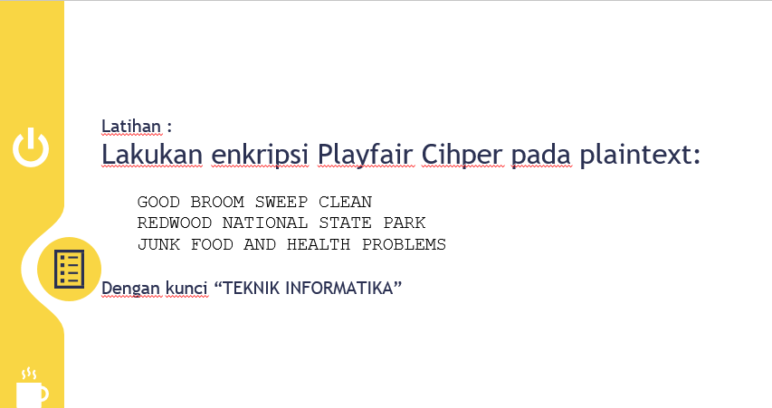
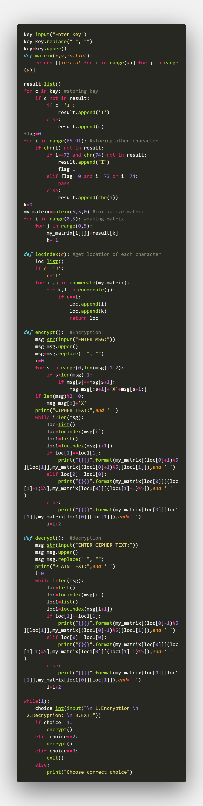
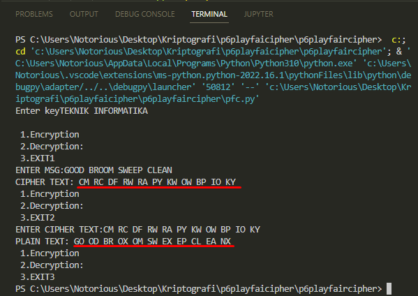
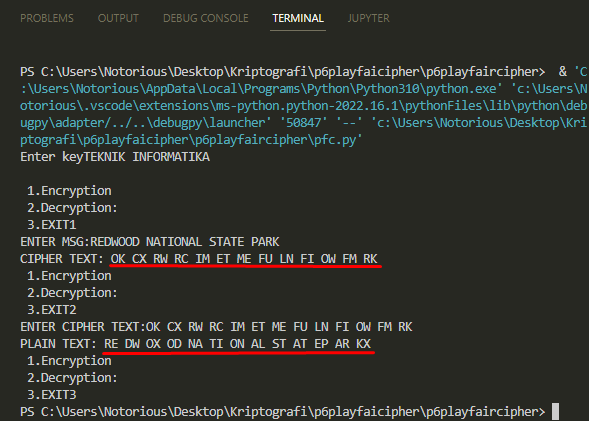
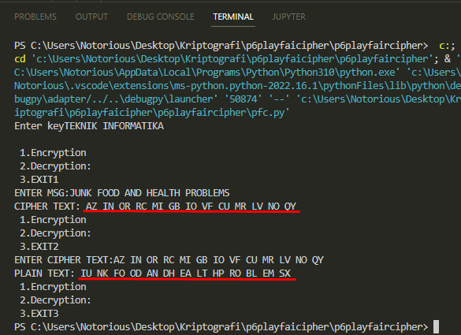

# Latihan-Pertemuan 6 : Playfair Cipher
Repository ini dibuat untuk memenuhi tugas pada Pertemuan ke-6 pada matakuliah Kriptografi.
 

<pre>
Nama        : Naufal Nirwansyah 
Kelas       : TI.20.A1
NIM         : 312010174
Matakuliah  : Kriptografi
Dosen       : Ahmad Turmudizy,S.Kom.,M.Kom
</pre>

***
 ## Tugas Pertemuan 6

 Pada pertemuan ke-6 yang lalu, saya mendapat tugas untuk mengerjakan task yang terdapat didalam materi pada pertemuan ke-6, berikut tugas yang terdapat dalam materi :  

 

Untuk membuat program yang diminta, saya menggunakan source code sebagai berikut:  

 

***

## Output

Dari script diatas jika kita run, maka akan menghasilkan outpus sebagai berikut :  

**1. GOOD BROOM SWEEP CLEAN WELL**

 
 

**2. REDWOOD NATIONAL STATE PARK**

 
 

**3. JUNK FOOD AND HEALTH PROBLEMS**

 

***
**Sekian tugas untuk pertemuan ke-6 mengenai materi Playfair Cipher, Terimakasih.**
 

**Naufal Nirwansyah | TI. 20. A1 | 312010174**